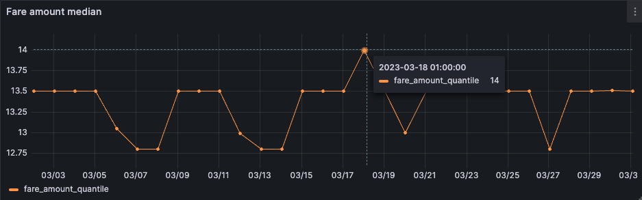

## Homework

To manually inspect the report run and get the answer to Q1 run the [baseline_model_nyc_taxi_data.ipynb](baseline_model_nyc_taxi_data.ipynb)

Copy the `lin_reg.bin` model into [models/](./models/) directory

Then spin up postgres+grafana stack by running
```shell
docker compose up
```

and run the [evidently_metrics_calculation.py](evidently_metrics_calculation.py) script by

```shell
python evidently_metrics_calculation.py
```

---

The goal of this homework is to familiarize users with monitoring for ML batch services, using PostgreSQL database to store metrics and Grafana to visualize them.


## Q1. Prepare the dataset

Start with `baseline_model_nyc_taxi_data.ipynb`. Download the March 2023 Green Taxi data. We will use this data to simulate a production usage of a taxi trip duration prediction service.

What is the shape of the downloaded data? How many rows are there?

* 72044


## Q2. Metric

Let's expand the number of data quality metrics we’d like to monitor! Please add one metric of your choice and a quantile value for the `"fare_amount"` column (`quantile=0.5`).

Hint: explore evidently metric `ColumnQuantileMetric` (`from evidently.metrics import ColumnQuantileMetric`) 

What metric did you choose?

`ColumnCorrelationsMetric`


## Q3. Prefect flow 

Let’s update prefect tasks by giving them nice meaningful names, specifying a number of delays and retries.

Hint: use `evidently_metrics_calculation.py` script as a starting point to implement your solution. Check the  prefect docs to check task parameters.

What is the correct way of doing that?

* `@task(retries=2, retry_delay_seconds=5, name="calculate metrics")`


## Q4. Monitoring

Let’s start monitoring. Run expanded monitoring for a new batch of data (March 2023). 

What is the maximum value of metric `quantile = 0.5` on th `"fare_amount"` column during March 2023 (calculated daily)?

* 14



## Q5. Dashboard


Finally, let’s add panels with new added metrics to the dashboard. After we customize the  dashboard lets save a dashboard config, so that we can access it later. Hint: click on “Save dashboard” to access JSON configuration of the dashboard. This configuration should be saved locally.

Where to place a dashboard config file?

* `project_folder/dashboards`  (05-monitoring/dashboards)
